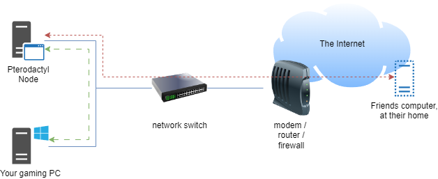

# Troubleshooting

## Just set up Pterodactyl, friend can't join server

This section is to assist with troubleshooting port forwards, firewall rules and DDNS issues.

_This guide is assuming you're hosting the server in your home network, not on a cloud host._

### 1. Confirm there is not an DDNS issue

_You can skip troubleshooting DDNS by trying to connect to your public IP instead_

1. Go to google and search 'what is my IP' and take note of the IP address
2. Launch CMD or the shell of your choice
3. Type ping `YOUR.DDNS.ADDRESS.HERE` and hit enter\
   eg `ping play.reallycoolservers.com`
4. Take note of the output, you should see something similar to the below results

#### Successful ping

```
C:\Users\x>ping play.reallycoolservers.com

Pinging play.agamersgrind.com [123.123.123.123] with 32 bytes of data: 
Reply from 123.123.123.123: bytes=32 time<1ms TTL=64 
Reply from 123.123.123.123: bytes=32 time<1ms TTL=64 
Reply from 123.123.123.123: bytes=32 time<1ms TTL=64 
Reply from 123.123.123.123: bytes=32 time<1ms TTL=64

Ping statistics for 123.123.123.123: Packets: Sent = 4, Received = 4, Lost = 0 (0% loss), Approximate round trip times in milli-seconds: Minimum = 0ms, Maximum = 0ms, Average = 0ms
```

A server has responded to your pings, great!

1. Confirm that the IP address matches your Google result
   * If it matches, great! Skip to
   * If it doesn't match, there is an issue with your DDNS container. Review the logs for the container

#### Unable to resolve DDNS

```
C:\Users\x>ping play.reallycoolservers.com

Ping request could not find host play.reallycoolservers.com. Please check the name and try again.
```

Your DDNS config is incorrect OR you've made a typo in your ping command.&#x20;

1. Firstly, review your ping command and ensure the address is correct
   * If it is correct, there is an issue with your DDNS container. Review the logs for that container
   * If you've made a typo, redo the test with the correct address

#### DNS resolves but server does not respond

```
C:\Users\x>ping play.reallycoolservers.com

Pinging play.reallycoolservers.com [123.123.123.123] with 32 bytes of data:
Request timed out.
Request timed out.
Request timed out.
Request timed out.

Ping statistics for 123.123.123.123:
    Packets: Sent = 4, Received = 0, Lost = 4 (100% loss),
```

You have resolved an IP address but the server does not respond to pings

1. Confirm that the IP address matches your IP
   * If the IP address matches, this isn't a bad thing - some firewalls are configured to NOT respond to pings as a security measure.
   * If the IP address does not match, there is something wrong with your DDNS container. Review the logs for the container

### 2. Narrow down the issue

There are multiple areas where this can go wrong. Lets narrow it down, please refer to the below image.

<div data-full-width="true">

<figure><figcaption><p>An example network map</p></figcaption></figure>

</div>

The above network map should be relatively similar to your home network. We have 5 devices,

1. Pterodactyl Node
2. Your gaming PC
3. network switch (you may not have one of these)
4. firewall
5. friends computer

Our end goal is for the red line (friends computer to pterodactyl node and back) to work.

There are a few places that this line can fail,

1. [Connecting to the internet domain / IP (and not reaching the modem)](troubleshooting.md#1.-confirm-there-is-not-an-ddns-issue)
2. Bad port forwarding config in the modem
3. Bad firewall config in the Pterodactyl node
4. Bad game server installation config

#### Option 3 is the easiest to confirm

To do this, we'll follow the green line.

1. Get the LAN IP address for your Pterodactyl node. This is likely to start with 192.x.x.x, 10.x.x.x or 172.x.x.x
2. Connect to your game server via the internal IP:port, eg 192.168.1.20:25565

#### Fails to connect

1. SSH onto your Pterodactyl node
2. Disable the firewall\
   If you are using Ubuntu, the command is listed below

<pre><code><strong>sudo UFW disable
</strong></code></pre>

3. Attempt to connect to the server via the internal IP:port

#### Connects successfully&#x20;


EDIT:

I'm trying to find a way to make a 'chose your own adventure' style book for this, where you click on your options and it goes through the relevant troubleshooting steps with you.
