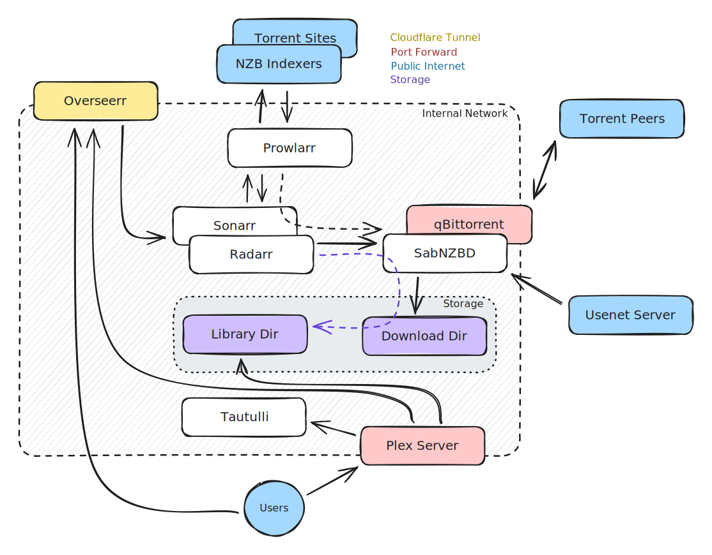

# Plex Suite

Plex is a tool for streaming local content to other devices. The Plex app is available on practically everything that other streaming services are (eg Netflix)

The other apps listed in this doco are here to integrate, manage and automate various systems to provide our viewers with the best content possible

## Flowchart 

### Software Defined Flowchart

This flowchart shows how the various applications link together at a software level

### Hardware defined flowchart

This flowchart shows the hardware side of things - what servers the applications live and tunnels to them

