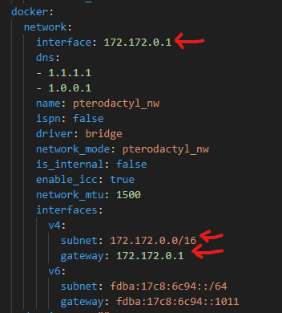

# Macaroni

## Specifications

<table><thead><tr><th width="234">Component</th><th>Model</th></tr></thead><tbody><tr><td>Case</td><td>Silverstone Alta G1M White (Planned PowerMac G4 swap)</td></tr><tr><td>Motherboard</td><td>MSI B660M Pro</td></tr><tr><td>CPU</td><td>i3 12100 (Planned i5 13500 upgrade)</td></tr><tr><td>CPU Cooler</td><td>Noctua NH-L9x65 (Planned upgrade)</td></tr><tr><td>RAM</td><td>4x32GB Vengeance LP, 3200mhz</td></tr><tr><td>GPU</td><td>Quadro P4000 GTX 1050 Ti</td></tr><tr><td>Power Supply</td><td>Corsair 600w SFX</td></tr><tr><td>Storage</td><td>2x NVME 2TB SDD 2x SATA 4TB HDD 1x SATA 128GB SSD</td></tr><tr><td>Other</td><td>HomeAssistant SkyConnect dongle ZWave Dongle</td></tr></tbody></table>

## ZFS Storage Pools

<table><thead><tr><th width="155">Name</th><th width="155">Type</th><th>Drives</th><th>Purpose</th></tr></thead><tbody><tr><td>SSDRAID</td><td>ZFS, MIRROR</td><td>2x 2TB NVME</td><td>VM Disk storage</td></tr><tr><td>HDD-MIRROR</td><td>ZFS, MIRROR</td><td>2x 4TB HDD</td><td>Backup storage</td></tr></tbody></table>

## Images

Images of the server below. Please note: These pictures will span multiple iterations so they hardware may look different between images

Early 2023

.png>)

Late 2023

.png>)
