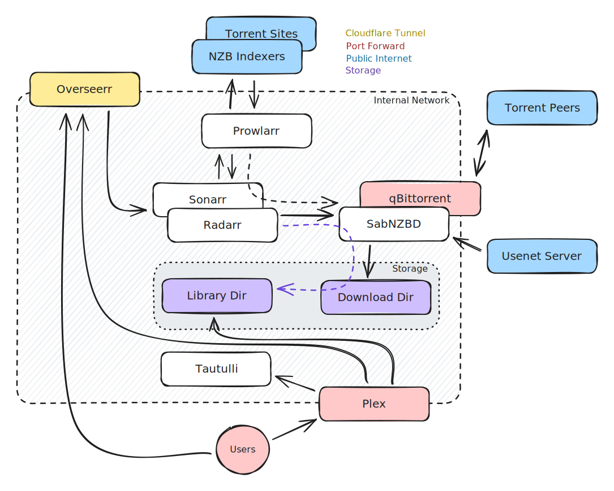

# Plex Suite

Plex is a tool for streaming local content to other devices. The Plex app is available on practically everything that other streaming services are (eg Netflix)

The other apps listed in this doco are here to integrate, manage and automate various systems to provide our viewers with the best content possible

#### Flowchart 

<figure><figcaption></figcaption></figure>

