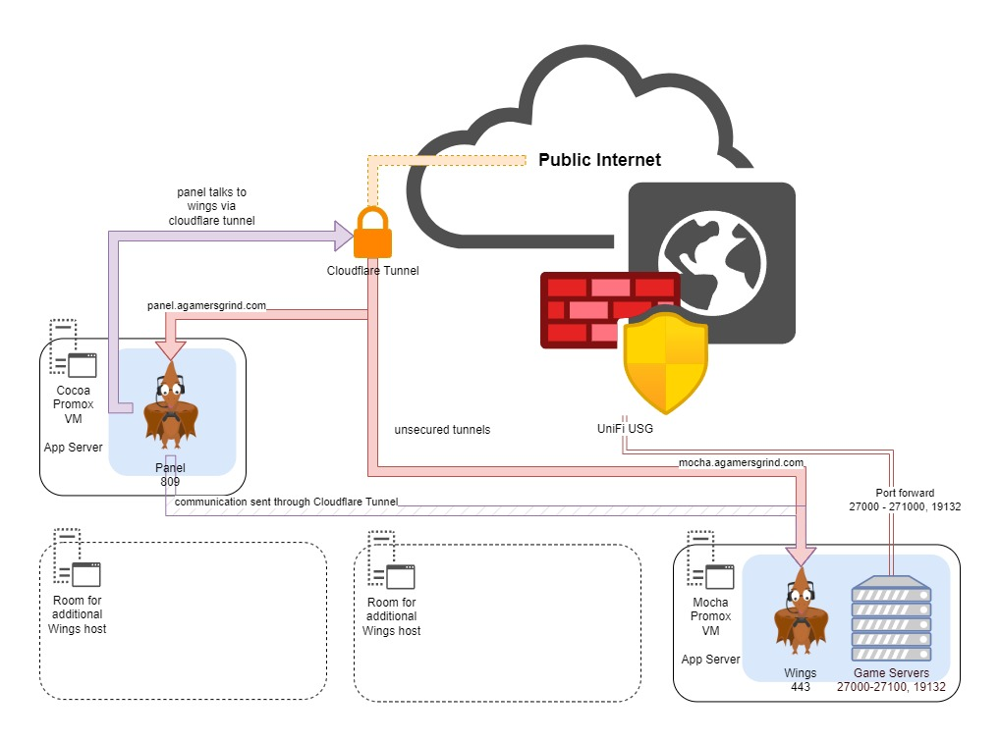

# Pterodactyl

[Link to App](https://panel.agamersgrind.com)

Pterodactyl® is a free, open-source game server management panel built with PHP, React, and Go. Designed with security in mind, Pterodactyl runs all game servers in isolated Docker containers while exposing a beautiful and intuitive UI to end users.

### Flowchart

<figure><figcaption></figcaption></figure>
